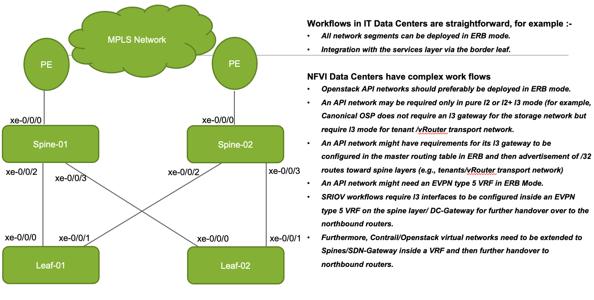
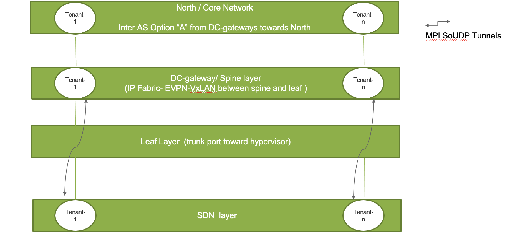

# ansible-junos-evpn-vxlan
* Group of Ansible playbooks to generate IP Fabric + EVPN configuration.
* For IP Fabric Deployment.  

* In addition to IP Fabric if Contrail-Networking is deployed as SDN Controller along with Open stack, then Spine Devices will have MP-IBGP connections with Contrail Contollers a
* Contrail vRouter will have  MPLSoUDP tunnels with  Spine devices / DC gateways

* Contrail Virtual Networks can be extended to Spines/ DC-Gateways and then further hand over to PE Routers via Inter AS Option A 


## Package Dependencies
**python**: Python 2.7.5  
**pip packages:**
ansible: 2.8.6  
jinja2: 2.10.3  

* Ansible user should be created and public keys should be configured on all devices  
* Complete packages list is available in hostRequirements.txt   

## Introduction
* These ansible playbooks are designed to work in multi-site deployments.

* Site specific variables should reside in ```inventory/{{site}}/group_vars/all/```  
* All hosts to be configured should be specified in ```inventory/{{site}}/hosts.yml```  

* Generated configuration for each device will be output to ```host_vars/{{site}}/{{inventory_hostname}}```

```host_vars/{{site}}/{{inventory_hostname}}/bakup/``` directory will contain all historical config generated by generate_ip_fabric.yml in previous runs.

**ansible.cfg** has the required master ansible configuration.
* If you are running from within a python virtual environment you will need to add 
```ini
interpreter_python="/path/to/virtual_environment/bin/python"
```
to **ansible.cfg**

## Playbook execution
* The playbooks are structured into roles.  
* These roles can be executed individually to generate specific configuration segments.  
* Alternatively the roles can be executed in a coordinated manner to generate entire configurations.

### Generating the complete configuration: 
i.e. executing all the roles
```shell
ansible-playbook -i inventory/lab/hosts.yml -e "site=lab" generate_ip_fabric.yml #here lab is dummy site so please use your site code accordingly 
```


### Generating specific configuration:
i.e. executing a specific role

Parameters to be passed:
-->rolename (name of role to be executed)

```shell
ansible-playbook generate_ip_fabric.yml -e "rolename=generate-overlay-vars" -i inventory/lab/hosts.yml -e "site=lab"  #here lab is dummy site so please use your site code accordingly
```
**OR**
```shell
ansible-playbook generate_ip_fabric.yml --extra-vars "rolename=generate-overlay-vars" -i inventory/lab/hosts.yml -e "site=lab" #here lab is dummy site so please use your site code accordingly
```

* In the above example rolename is generate-overlay-vars

List of roles all individual roles:

- generate-p2p-ips
- generate-underlay-vars
- generate-underlay-ebgp
- generate-overlay-vars
- generate-overlay-ibgp
- generate-tenant-vars
- generate-tenant-config
- generate-evpn-access
- generate-assembled-configuration

### Pushing the configuration
* Once the configuration has been generated, it needs to be pushed to the network.

* Pushing the generated configuration to all the hosts:
```shell
ansible-playbook final_config_push.yml -vvv -i inventory/lab/hosts.yml -e "site=lab" , # here lab is dummy site so please use your site code accordingly
```

* Pushing the generated configuration to a particular host device:
```shell
ansible-playbook final_config_push.yml -vvv --limit leaf-01 -i inventory/lab/hosts.yml -e "site=lab" , #here lab is dummy site so please use your site code accordingly
```

### Dry run
It is possible to run ```final_config_push``` as a dry run to see what changes will be pushed without commiting the changes.  This pushes the configuration, performs a ```show| compare``` then performs a ```rollback``` and exists from the device.

```shell
ansible-playbook final_config_push.yml -vvv --check --diff -i inventory/lab/hosts.yml -e "site=lab" , # here lab is dummy site so please use your site code accordingly
```

### Commit Confirm
* Push with commit-confirm and commit-minutes for all hosts -- If the configuration is not pushed within the commit minutes time the configuration will be roled back.
* Parameters to be passed:
->commit_confirm (yes or no)
->commit_minutes Ex(1,2)

```shell
ansible-playbook commit_confirm_push.yml -e "commit_confirm=yes commit_minutes=1" -i inventory/lab/hosts.yml -e "site=lab" , #here lab is dummy site so please use your site code accordingly
```

* Push with commit-confirm and commit-minutes for a particular host:
```shell
ansible-playbook commit_confirm_push.yml -e "commit_confirm=yes commit_minutes=1" --limit leaf-01 -i inventory/lab/hosts.yml -e "site=lab" , #here lab is dummy site so please use your site codeaccordingly
```

### Fabric verfication  
* This package also contains a playbook to run many verification tests on the fabric to ensure it is operational after configuration has been pushed.

```shell
ansible-playbook -i inventory/lab/hosts.yml -e "site=lab" check_ip_fabric.yml, #here lab is dummy site so please use your site codeaccordingly
```
* or Optionally run following playbooks one by one
```
fabric_ebgp_status_check.yml
fabric_esi_lag_status_check.yml
fabric_links_status_check.yml
fabric_ibgp_status_check.yml
fabric_vtep_status_check.yml
fabric_underlay_interfaces_icmp_check.yml
```

### Collect CLI output
* There is also a playbook to collect any arbitrary CLI output.
* To collect Junos CLI output execute ```check_cli.yml``` playbook.   
* The output to gather can be customised be modifiying ```inventory/{{site}}/group_vars/all/cli.yml```  
